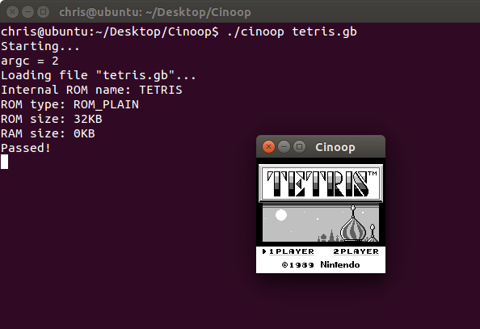

Cinoop
======
A Game Boy emulator for Windows, DS, GameCube, 3DS, Linux based OSes, and PSP, written in C.

Read my article about writing Cinoop [here](http://cturt.github.io/cinoop.html).

## Progress
**CPU:** All instructions are implemented,

**GPU:** Can display tile maps, and sprites. Palette swapping is not implemented yet, so some colours may be displayed incorrectly.

**Memory:** Support for 32KB ROMs, without mappers, only (Tetris and Dr. Mario),

**Input:** Supported,

**Sound:** None,

**Games:** Tetris is most likely the only playable game,

The DS and 3DS emulator do not run full speed. The Linux port does not yet support input.

## Building
Just run `make` on the directory to build all binaries. You can also run `make windows` for just Windows, `make ds` for just DS, `make gamecube` for just GameCube, `make 3ds` for just 3DS, or `make linux` for just Linux.

Building the Windows version requires [LDFS](https://github.com/CTurt/LDFS), and has been tested with [MinGW](http://www.mingw.org/), using another compiler may require some tweaking.

Building the DS version requires devkitARM and libnds, from [devkitPro](http://devkitPro.org).

Building the GameCube version requires devkitPPC and libogc, from [devkitPro](http://devkitPro.org).

Building the 3DS version requires devkitARM and ctrulib from [devkitPro](http://devkitPro.org).

Building the Linux version requires [X11](http://en.wikipedia.org/wiki/X_Window_System), and the OpenGL development files. It has been tested with [Ubuntu](http://www.ubuntu.com/).

Building the PSP version requires the [Minimalist PSP SDK](http://sourceforge.net/projects/minpspw/).

## Usage
For Windows and Linux, pass the ROM you would like to run as the first argument. You can do this by either dragging the ROM onto Cinoop, or starting it from the command line:

    cinoop tetris.gb

To view the full debug log, you will need to redirect `stdout` to a file, like so:

    cinoop tetris.gb 1>debug.txt

For other versions, the ROM name is hard coded as `tetris.gb`.

### Windows Controls
- B: Z
- A: X
- Start: Enter
- Select: Backspace
- DPad: Arrow keys

- Debug: Space
- Reset (not finished yet): *
- Quit: Escape

### DS Controls
- B: B
- A: A
- Start: Start
- Select: Select
- DPad: DPad

### GameCube Controls
- B: B
- A: A
- Start: Start
- Select: Z
- DPad: DPad

### 3DS Controls
- B: B
- A: A
- Start: Start
- Select: Select
- DPad: DPad

### Linux Controls
(not supported)

### PSP Controls
- B: Square
- A: Cross
- Start: Start
- Select: Select
- DPad: DPad
