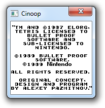

Cinoop
======
A Game Boy emulator for Windows and DS, written in C.

## Progress
**CPU:** Around half of the CPU instructions are implemented,

**GPU:** Can display tile maps, no sprites,

**Memory:** Support for 32KB ROMs, without mappers, only,

**Input:** Supported,

**Sound:** None,

**Games:** Cinoop can almost play Tetris; sprites are not displayed, so you can only see a piece once it has reached the bottom, and there is no random number generator, so the same piece is always given, and there are many unimplemented instructions. It is unlikely that any games are playable yet.

**Optimisations to do:** Currently the DS renders the Game Boy screen in framebuffer mode, this is slow. The DS supports hardware tile rendering, which will be much faster.

## Building
Just run `make` on the directory to build both the DS and Windows binaries. Or, `make cinoop.exe` for just Windows, and `make dbuild` for just DS.

Building the Windows version requires [LDFS](https://github.com/CTurt/LDFS), and has been tested with [MinGW](http://www.mingw.org/), using another compiler may require some tweaking.

Building the DS version requires devkitARM and libnds, from [devkitPro](http://devkitPro.org).

## Usage
Pass the ROM you would like to run as the first argument. You can do this by either dragging the ROM onto Cinoop, or starting it from the command line:

    cinoop tetris.gb

To view the full debug log, you will need to redirect `stdout` to a file, like so:

    cinoop tetris.gb 1>debug.txt

### Windows Controls
- B: Z
- A: X
- Start: Enter
- Select: Backspace
- DPad: Arrow keys

- Debug: Space
- Reset (not finished yet): *
- Quit: Escape

### DS Controls
- B: B
- A: A
- Start: Start
- Select: Select
- DPad: DPad